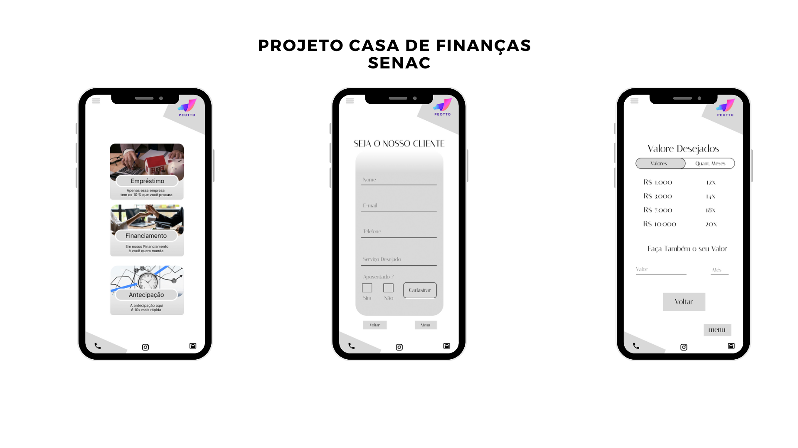

<h1 align="center">
  Projeto Curso Senac
</h1>

  

## 💻 Projeto

Projeto feito no curso de **Desenvolvimento de Sistemas** no Senac usando _HTML_ e _CSS_.

## 🚀 Tecnologias

- HTML
- CSS

## 🔎 Veja mais de perto

Linkedin: 
 
Behance: 
